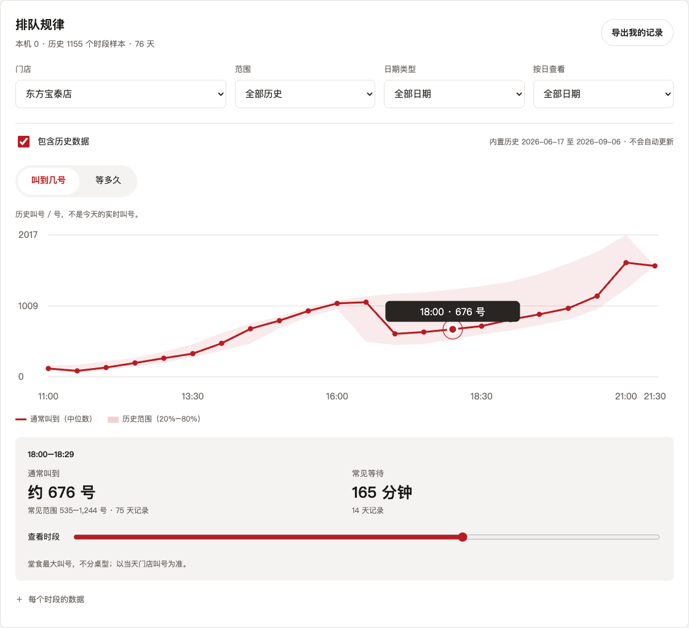
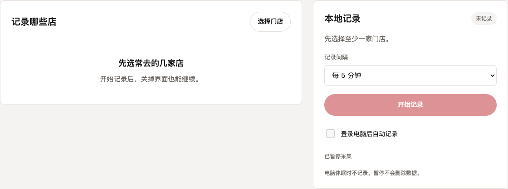

# 寿司郎排队记录

**Sushiro Overdose · lite正式版**

记下常去门店的排队情况，看看几点通常叫到几号、要等多久。想去吃饭时，再手动取号。

[下载最新版](https://github.com/Ryujoxys/sushiro-overdose/releases/latest) · [反馈问题](https://github.com/Ryujoxys/sushiro-overdose/issues)

## 开始记录

1. 打开应用，选择常去的门店。
2. 点击「开始记录」，数据留在自己电脑上。
3. 按日期看曲线，也可以导出自己的记录继续分析。

**记录不需要登录、证书或代理。** 后台启动后，关闭窗口仍会记录；可以单独开启登录自启动，电脑休眠时暂停。

首次打开就能看曲线：内置历史截至 **2026-09-06**，不会自动更新。取消「包含历史数据」，就只分析自己收集的记录。

## 手动取号

进入「手动取号」，选店、填人数，连接本人账号后确认提交。「想几点吃」提供时间参考，入座以门店叫号为准。

认证只在需要取号时设置，凭证保存在本机。macOS 可用电脑微信，Windows 推荐按引导使用手机微信。[认证与安全说明](SECURITY.md)

## 下载

| 系统 | 安装包 |
|---|---|
| Windows 10 / 11 | [64 位 EXE](https://github.com/Ryujoxys/sushiro-overdose/releases/download/v4.0.1/Sushiro-Overdose-4.0.1-windows-amd64.exe) · [ARM64 EXE](https://github.com/Ryujoxys/sushiro-overdose/releases/download/v4.0.1/Sushiro-Overdose-4.0.1-windows-arm64.exe) |
| macOS 12+，Intel / Apple 芯片 | [DMG](https://github.com/Ryujoxys/sushiro-overdose/releases/download/v4.0.1/Sushiro-Overdose-4.0.1-macOS.dmg)，拖入「应用程序」后打开 |

桌面版使用系统 WebView，无需部署网站。Windows 缺少 WebView2 时会引导安装；macOS 首次打开若提示来源未知，请核对下载来源后在「隐私与安全性」允许打开。

Linux 与命令行压缩包、校验值见[发布页](https://github.com/Ryujoxys/sushiro-overdose/releases/latest)。升级前关闭旧窗口、停止旧后台，再替换程序；本机记录保留。

[开发与构建](CONTRIBUTING.md) · [架构](ARCHITECTURE.md) · [数据与历史包](docs/bundled-history.md) · [更新说明](docs/release-notes-4.0.1.md)

## Star 趋势

[MIT](LICENSE) · 非官方工具，与寿司郎官方无隶属关系。
