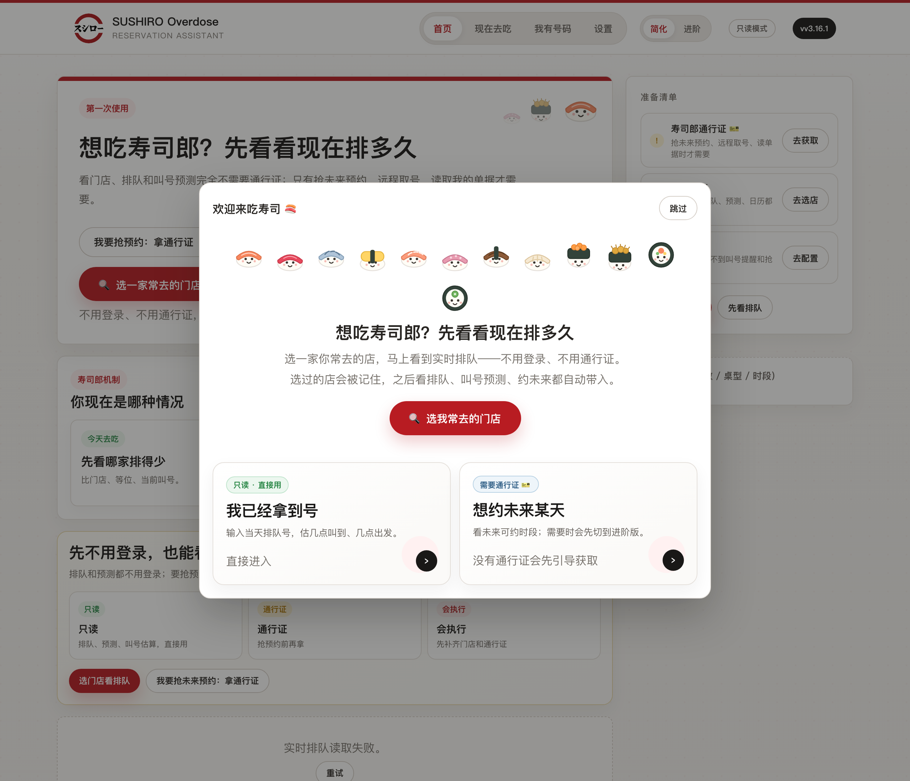
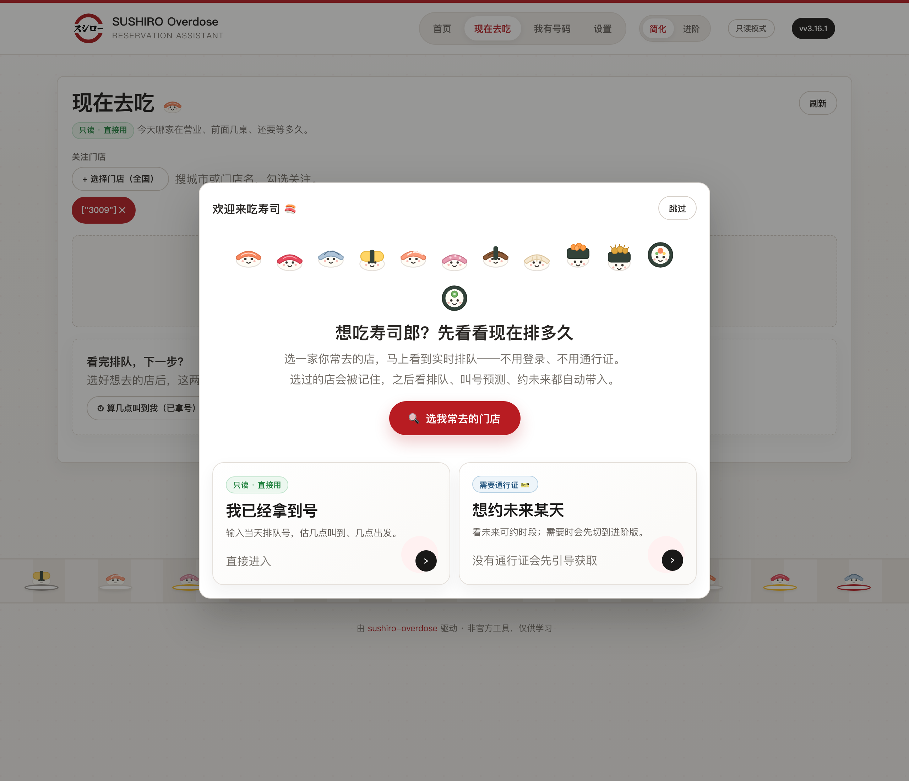

# 寿司郎排队助手（Sushiro Overdose）

拿号之后，告诉你大概几点叫到、几点该出门——不用自己盯着大屏算。

开源桌面工具，macOS / Windows / Linux 都能用，Go 写的，零外部依赖。

[](https://github.com/Ryujoxys/sushiro-overdose/releases/latest)
[](https://github.com/Ryujoxys/sushiro-overdose/actions/workflows/ci.yml)
[](#下载)
[](LICENSE)

<p align="center">
  
</p>

---

## 它能干什么

| 用法 | 说明 |
|------|------|
| **📱 没号，想看排队** | 不用登录。挑一家店，看开着没、排几桌、等多久、这会儿挤不挤。 |
| **🎫 有号了（最常用）** | 填进排队号，给出预计叫到时间和出发时间，跟着叫号进度实时更新。快叫到了还能推送提醒。 |
| **📅 想约未来某天** | 查未来哪些时段还能约，热门时段挂着等，一开放就帮你订上。这个需要登录凭证（见下文「通行证」）。 |

> **预测长这样**：`1078 号，当前叫到 1051，预计 38–62 分钟后叫到（约 12:18–12:42）。建议 12:10 前后出发。`

<p align="center">
  
</p>

快叫到了可以推一条通知（飞书 / Telegram / Bark / Server酱，能同时开多个），先找地方坐会儿，不用一直守着屏幕。

## 下载

去 [Latest Release](https://github.com/Ryujoxys/sushiro-overdose/releases/latest) 下对应平台的包，或一行命令装：

| 平台 | 文件 | 一行安装 |
|------|------|----------|
| **Windows** | `*-windows-amd64.exe`（ARM 用 `windows-arm64.exe`） | `irm https://raw.githubusercontent.com/Ryujoxys/sushiro-overdose/master/install/install.ps1 \| iex` |
| **macOS** | `*-macOS.dmg`，拖进 Applications | （首次打开会被拦，见下方说明） |
| **Linux** | `*_linux_amd64.tar.gz` | `curl -fsSL https://raw.githubusercontent.com/Ryujoxys/sushiro-overdose/master/install/install.sh \| bash` |

装好双击运行，会自动弹出网页界面。搜城市或门店名挑一家店——没号看排队，有号填号码。想要到点提醒，去设置里填个通知地址。

> **macOS 首次打开被拦？** 不是安全问题，是没花钱买 Apple 签名（开源非商用）。代码全部可审计（见 [SECURITY.md](SECURITY.md)）。放行一次即可永久可用：
> - **最简单**：双击 App 弹「无法打开」后，进 **系统设置 → 隐私与安全性**，滚到「已阻止使用 "Sushiro Overdose"」，点 **仍要打开**。
> - **或**：访达里 **按住 Control 点按** App → **打开** → 再点 **打开**。
> - **都不行**：终端跑 `xattr -dr com.apple.quarantine "/Applications/Sushiro Overdose.app"`。

<details>
<summary>从源码构建</summary>

需要 Go 1.23+（[下载](https://go.dev/dl/)）。纯标准库，无需第三方依赖。

```bash
git clone https://github.com/Ryujoxys/sushiro-overdose.git
cd sushiro-overdose
go build -o sushiro .
./sushiro          # 自动开浏览器到 http://127.0.0.1:39871
```

验证：`go test ./... && go vet ./... && gofmt -l .`

</details>

## 🔒 安全与隐私

- 排队和叫号信息本来就公开（小程序里也显示），工具只是读出来算一下，**不抢号、不碰别人账号、不上传服务器**。
- 凭证只存你本机（`~/.sushiro/`），不传任何第三方。
- MITM 抓包**只解密寿司郎域名**，其他流量原样透传。
- 任何动账号的操作（取号、预约、取消）都会先弹窗确认。
- 代码全开源，详见 [SECURITY.md](SECURITY.md)。

## 通行证是什么

只看排队和叫号预测**不用登录**。需要「动账号」的操作（预约、远程取号、取消、读我的单据）才用通行证——从寿司郎微信小程序请求里提取的一次登录凭证。

凭证会过期或被手机重新登录顶掉。出现 `E010 / error.server`、401/403、取号或预约突然失败时，在设置里重置认证再重新获取即可。Windows 一般手机抓包导入，macOS 可先试 PC 微信自动捕获，向导会一步步提示。

## 命令行

```bash
sushiro                 # 启动 Web UI（默认）
sushiro cli             # 终端交互模式
sushiro calendar        # 查可预约时段
sushiro list            # 查当前预约
sushiro cancel <id>     # 取消预约
sushiro sample once     # 采集一次排队/时段数据
sushiro doctor          # 只读诊断
sushiro repair-proxy    # 恢复系统代理
sushiro uninstall       # 清理本地敏感数据和证书
sushiro help            # 更多命令
```

## 遇到问题

| 现象 | 处理 |
|------|------|
| 打不开页面 | 重跑，端口冲突会自动换端口 |
| 系统代理异常 | `sushiro repair-proxy`，或设置页点代理修复 |
| 通知收不到 | 设置页「测试通知」，确认 Webhook / Token |
| 取号失败 E010 | 先重置认证，再重新获取通行证 |
| macOS 打不开 App | 见上方「macOS 首次打开被拦」 |
| Windows 被拦截 | SmartScreen 点「更多信息」→「仍要运行」 |

更详细的诊断跑 `sushiro doctor`。

## 开发

架构和文件职责见 [ARCHITECTURE.md](ARCHITECTURE.md)，开发约定见 [AGENTS.md](AGENTS.md) 和 [CONTRIBUTING.md](CONTRIBUTING.md)。

```bash
go build ./... && go test ./... && go vet ./...
```

发新版本：`git tag vX.Y.Z && git push origin vX.Y.Z`，GitHub Actions 自动构建三平台产物并创建 Release。

## License

MIT
